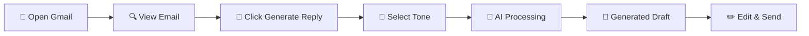

# 🚀 AI Email Reply Chrome Extension

> A powerful Chrome extension that generates context-aware email responses directly within Gmail using Google's **Gemini API**. Streamline your communication with intelligent, personalized replies in just one click.

[](https://chrome.google.com/webstore)
[](https://developer.mozilla.org/en-US/docs/Web/JavaScript)
[](https://ai.google.dev/)

---

## ✨ Features

### 🤖 **AI-Powered Replies**
Generate professional and context-relevant email responses using Google's advanced Gemini API.

### 📧 **Seamless Gmail Integration**
Works directly inside Gmail's interface for a smooth, native user experience.

### 🎨 **Customizable Tone**
Adjust the tone of your replies to match any situation:
- 📝 **Formal** - Professional business communication
- 💬 **Casual** - Relaxed, everyday conversations  
- 😊 **Friendly** - Warm and approachable responses
- 🎯 **Custom** - Define your own tone preferences

### ⚡ **Lightweight & Fast**
Built with vanilla JavaScript and efficient API handling for lightning-quick responses.

---

## 🔧 How It Works



1. **Install** the extension in your Chrome browser
2. **Open** Gmail and compose or view an email
3. **Click** the "Generate Reply" button added by the extension
4. **Select** your preferred reply tone (optional)
5. **Review** the AI-generated email draft
6. **Edit** if needed and send your response

---

## 📁 Project Structure

```
email-reply-extension/
├── 📋 manifest.json          # Chrome extension configuration
├── 🔧 content.js             # Gmail DOM interaction script
├── ⚙️ background.js          # API requests & extension logic
├── 🖼️ popup.html             # Extension popup interface
├── 📱 popup.js               # Popup functionality
├── 🎨 styles.css             # UI styling
└── 🖼️ icons/                 # Extension icons
    ├── icon16.png
    ├── icon48.png
    └── icon128.png
```

---

## 🛠️ Technologies Used

| Technology | Purpose | Version |
|------------|---------|---------|
|  | Frontend Logic | ES6+ |
|  | Interface Structure | HTML5 |
|  | UI Styling | CSS3 |
|  | AI Processing | Latest |
|  | Platform | Manifest V3 |

---

## 🚀 Setup & Installation

### Prerequisites
- Chrome browser (version 88+)
- Google Gemini API key ([Get one here](https://ai.google.dev/))

### Step-by-Step Installation

#### 1. 📥 Clone the Repository
```bash
git clone https://github.com/yourusername/email-reply-extension.git
cd email-reply-extension
```

#### 2. 🔑 Configure API Key
Open `background.js` and add your Gemini API key:

```javascript
const GEMINI_API_KEY = "YOUR_GEMINI_API_KEY_HERE";
```

> ⚠️ **Security Note**: Never commit your API key to version control. Consider using environment variables for production.

#### 3. 🔧 Load Extension in Chrome
1. Open `chrome://extensions/` in your browser
2. Toggle **Developer Mode** to ON (top-right corner)
3. Click **"Load Unpacked"**
4. Select the `email-reply-extension` folder
5. The extension icon should appear in your toolbar

#### 4. 🎉 Start Using
1. Navigate to [Gmail](https://mail.google.com)
2. Open any email thread
3. Look for the **"Generate Reply"** button
4. Click and watch the magic happen! ✨

---

## 🤝 Contributing

We welcome contributions! Please follow these steps:

1. 🍴 Fork the repository
2. 🌿 Create a feature branch (`git checkout -b feature/amazing-feature`)
3. 💾 Commit your changes (`git commit -m 'Add amazing feature'`)
4. 📤 Push to the branch (`git push origin feature/amazing-feature`)
5. 🔄 Open a Pull Request

---

## 📄 License

This project is licensed under the MIT License - see the [LICENSE](LICENSE) file for details.

---

## 🙏 Acknowledgments

- Google Gemini API team for the powerful AI capabilities
- The Chrome Extensions community for inspiration and guidance
- All contributors who help make this project better

---

<div align="center">

**⭐ If you found this project helpful, please give it a star! ⭐**

Made with ❤️ by [Gaurav](https://github.com/gp0814)

</div>
